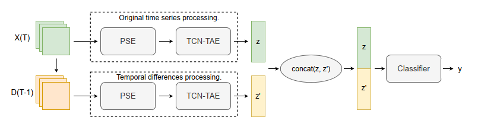

Code repository for the paper "Crop classification from satellite image sequences using a two-stream network with temporal self-attention"





[Paper](https://ieeexplore.ieee.org/document/9827752) abstract:

*In recent years the availability of satellite image observations of Earth has been increasing, creating opportunities for automated methods to be applied in tasks with significant economic importance, such as agricultural parcel crop classifica- tion. Designing and implementing automated methods that can efficiently interpret satellite images and handle their temporal nature poses a significant challenge in remote sensing. Deep learning models have proven to be able to leverage these type of data, taking into consideration both their spatial as well as temporal nature. Building on a state-of-the-art architecture using self-attention to classify crops captured in satellite images time series, we introduce two changes in order to better capture the crop phenology. Specifically, the calculation of the self-attention Query is performed by a Temporal Convolutional Network (TCN), while the TCN output is also taken under consideration for the final classification. Moreover, we utilize the temporal differences between consecutive time steps to create an auxiliary time series that can be employed alongside the original time series, in a two-stream architecture, that proves to be capable of further improving performance. We also conduct a detailed ablation study to assess the impact of these contributions. The proposed model was able to produce results that exceed the state-of-the-art on the publicly available Sentinel2-Agri dataset.*


## Requirements
- Pytorch=1.10.2
- torchnet=0.0.4
- numpy=1.21.2 
- pandas=1.4.1 
- scikit-learn=1.0.2

The code was tested on Ubuntu 20.04.5 LTS with Python 3.9.13 and CUDA 11.4     

### Dataset
The model was trained with the Pixelset dataset created by [Garnot et al.](https://arxiv.org/abs/1911.07757) 
In order to access the data an email request may be sent to them. More information regarding data structure and formats may be found at the authors' github
[here](https://github.com/VSainteuf/pytorch-psetae/tree/master).

### Pre-trained weights
Pretrained weights may be found in results/pretrained


## Code 

Run `train.py` to reproduce the results in the paper.


## Credits

- Code has been heavily inspired by [Garnot et al.](https://arxiv.org/abs/1911.07757)

## Reference

In case you use part of the present code, please include a citation to the following paper:

```
@inproceedings{stergioulas2022crop,
  title={Crop classification from satellite image sequences using a two-stream network with temporal self-attention},
  author={Stergioulas, Andreas and Dimitropoulos, Kosmas and Grammalidis, Nikos},
  booktitle={2022 IEEE International Conference on Imaging Systems and Techniques (IST)},
  pages={1--6},
  year={2022},
  organization={IEEE}
}

```

